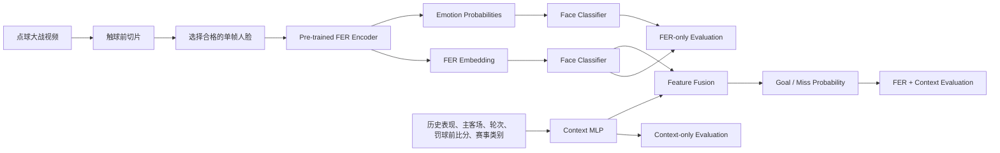

# Course Project Plan

## 1. 暂定题目

### 推荐题目

**Can Pre-trained Facial Expression Representations Predict Penalty Shootout Outcomes?**  
**预训练面部表情表征能否预测点球大战结果？**

### 完整题目

**Evaluating Facial Expression and Match Context for Penalty Shootout Outcome Prediction**

中文：

**面部表情与比赛上下文对点球大战结果的预测研究**

---

## 2. 项目概述（Project Overview）

本项目研究球员在点球大战主罚前的面部视觉信息，能否在历史点球表现和比赛上下文之外，为本次罚球结果提供额外的预测信号。

项目只收集点球大战（penalty shootout）中的罚球，不考虑常规时间或加时赛中的单次点球。对于每次罚球，只使用触球前的画面，从中选择一张质量合格的主罚球员面部图像。

项目不实现多帧时序模型或 GRU，而是建立两条独立分支：

1. **FER 分支**：使用预训练 Facial Expression Recognition（FER）模型提取面部表征；
2. **Context 分支**：使用 MLP 编码历史点球表现、主客场、点球大战轮次、罚球前比分和赛事类别。

最后融合两条分支，预测该次罚球是 `Goal` 还是 `Miss`。

项目重点不是声称模型能够读取球员真实心理状态，而是通过严格对照实验回答：预训练 FER 表征是否具有预测价值，以及它是否能在 context-only 模型基础上带来额外收益。

---

## 3. 研究范围（Scope）

### 包含内容

- 点球大战中的罚球事件；
- 每次罚球触球前的单帧面部图像；
- 预训练 FER encoder 的情绪概率与中间层 embedding；
- 基于五类上下文变量的 Context MLP；
- FER-only、Context-only 和 FER+Context 三类模型；
- 冻结 FER 与部分微调 FER 的比较；
- 以比赛为分组单位的跨比赛评估；
- 面部质量、身份信息和数据泄漏分析。

### 不包含内容

- 常规时间或加时赛中的单次点球；
- 罚球后的表情、射门动作或守门员反应；
- 多帧视频建模；
- GRU、LSTM 或 Temporal Transformer；
- 将 FER 输出解释为球员真实心理状态；
- 使用本次罚球结果发生后才能获得的信息。

---

## 4. 研究问题（Research Questions）

### RQ1：FER 表征是否具有预测能力？

主罚前单帧面部图像的 FER 表征是否能够预测本次点球结果？

### RQ2：哪种 FER 输出更有效？

FER encoder 的中间层 embedding 是否比最终的基本情绪概率提供更多预测信息？

### RQ3：FER 预训练是否具有特殊价值？

在相同下游分类器设置下，FER-pretrained encoder 是否优于普通 ImageNet-pretrained encoder？

### RQ4：部分微调是否有效？

在当前数据规模下，部分微调 FER encoder 是否优于完全冻结 encoder？

### RQ5：Context 能够解释多少预测信息？

仅使用历史点球表现、主客场、点球大战轮次、罚球前比分和赛事类别时，Context MLP 能达到怎样的预测性能？

### RQ6：FER 是否具有增量价值？

融合 FER 和 context 后，是否能够稳定优于 Context-only 模型？

### RQ7：模型能否跨比赛泛化？

当测试集由训练阶段未见过的完整点球大战组成时，模型是否仍然有效？

---

## 5. 可证伪假设（Falsifiable Hypotheses）

### H1：FER 表征包含点球结果相关信号

FER-only 模型在 AUROC、AUPRC 或 Brier score 上优于多数类基线。

**反证条件：**如果 FER-only 模型在 match-disjoint 测试中不优于简单基线，则没有足够证据支持面部表征具有稳定预测价值。

### H2：FER embedding 优于情绪概率

FER 中间层 embedding 比最终的基本情绪概率向量具有更好的预测性能。

**反证条件：**如果两者表现相当，则高维 embedding 没有显示额外价值；如果两者都无效，则通用 FER 表征可能不适合该场景。

### H3：FER 预训练优于普通视觉预训练

在骨干网络规模和下游分类器尽量一致时，FER-pretrained encoder 优于 ImageNet-pretrained encoder。

**反证条件：**如果 ImageNet encoder 表现相当或更好，则不能将模型效果归因于表情识别预训练。

### H4：部分微调能够改善领域适配

只解冻 FER encoder 的最后一个 block，并使用较小学习率微调，能够优于完全冻结 encoder。

**反证条件：**如果部分微调没有提升 match-disjoint 测试性能，或只提升训练性能，则微调可能造成过拟合。

### H5：Context MLP 具有有效基线性能

五类上下文变量能够提供高于多数类基线的预测能力。

**反证条件：**如果 Context-only 模型不优于基线，则当前上下文变量或样本规模不足以解释结果差异。

### H6：FER 具有增量预测价值

FER+Context 模型在相同测试集上优于 Context-only 模型。

**反证条件：**如果融合后没有稳定改善，则面部信息没有显示超出已知上下文的增量价值。

### H7：随机事件划分会高估性能

Random event split 的表现高于 match-disjoint split，因为随机划分可能共享同场比赛的转播风格、背景和相关球员。

**反证条件：**如果两种划分的表现接近，则比赛级信息共享对当前模型影响有限。

---

## 6. 数据计划（Dataset Plan）

### 6.1 两阶段数据建设

#### 阶段一：20 场 Pipeline 可行性验证

首先收集约 20 场完整点球大战。该阶段的目的不是直接形成最终数据集或给出最终模型结论，而是验证整套 pipeline 是否可行，包括：

- 视频能否稳定获得；
- 点球事件能否高效切片；
- 触球前是否经常出现清晰的主罚球员面部；
- 人脸检测、确认和裁剪是否可靠；
- FER 模型能否处理足球转播画面；
- 五类 context 信息能否完整、无泄漏地获得；
- 每场比赛的人工处理时间是否可接受；
- Goal/Miss 比例和有效样本率是否支持后续建模。

一场点球大战通常包含约 8–12 次或更多罚球，因此 20 场预计提供约 160–240 个原始罚球事件。经过面部质量筛选后，有效样本数会更少。该阶段主要用于估计有效样本率和处理成本，不应仅凭 20 场数据作强结论。

#### 阶段二：扩展至 60–80 场正式数据集

如果 20 场验证表明 pipeline 可行，计划扩展到约 60–80 场点球大战。

粗略预期：

- 原始罚球事件约 480–960 个；
- 最终有效样本数由阶段一测得的人脸可用率决定；
- 比赛数量增加后，可以进行更可靠的 match-disjoint cross-validation；
- 数据允许时，可以额外进行 player-disjoint 或跨赛事泛化分析。

最终样本量必须根据实际数据统计报告，不能只报告计划场次数量。

### 6.2 Pipeline 可行性指标

20 场验证阶段需要记录以下指标：

| 指标 | 目的 |
|---|---|
| 原始罚球事件数 | 估算每场平均样本量 |
| 有触球前面部画面的比例 | 判断研究输入是否普遍存在 |
| 通过质量筛选的比例 | 估算最终有效样本量 |
| Goal/Miss 数量及比例 | 判断类别不平衡程度 |
| 自动人脸检测成功率 | 评估自动化程度 |
| 人工修正比例 | 估算标注工作量 |
| 单场平均处理时间 | 估算扩展至 60–80 场的成本 |
| Context 字段缺失率 | 判断 Context MLP 是否可行 |
| FER 输出分布 | 检查是否几乎全部预测为 neutral |

建议在 20 场验证后设置明确的继续条件：

- 有效人脸比例足以支持扩大数据；
- 预计扩展后的 Miss 样本数量足以评估模型；
- 每场人工成本在项目时间预算内；
- 历史表现与比赛 context 能够可靠获取；
- 不存在系统性的结果泄漏。

### 6.3 样本定义

每个样本对应点球大战中的一次罚球，包含：

- 一段在触球前结束的视频切片；
- 从切片中选择的一张主罚球员面部图像；
- 点球结果标签；
- 五类 context 特征；
- 比赛、球员和赛事标识；
- 人脸质量信息。

### 6.4 结果标签

- `1 = Goal`：进球；
- `0 = Miss`：未进球，包括被扑出、射偏和击中门框。

可以额外记录 `saved`、`off_target` 和 `woodwork`，但主要任务保持二分类。

### 6.5 面部帧选择规则

对每次罚球，从触球前切片中选择**最接近触球时刻且质量合格的一张主罚球员面部图像**。

选择规则必须在查看模型结果前固定：

1. 图像必须出现在触球前；
2. 人脸检测置信度高于预设阈值；
3. 人脸达到最低像素尺寸；
4. 眼眉和嘴部没有严重遮挡；
5. 若最后一帧质量不合格，则按时间向前寻找最近的合格帧；
6. 若整个切片没有合格面部帧，则丢弃该样本并记录原因。

禁止使用罚球后的表情，因为它会直接泄漏点球结果。

### 6.6 Context 特征

Context 分支只包含以下五类信息。

#### 1. 历史点球表现（Historical Penalty Performance）

使用该球员在本次罚球发生前的历史记录：

- 历史罚球次数；
- 历史进球次数；
- 历史成功率；
- 是否缺少历史记录。

> **2026-09-18 修订（pilot）**：历史记录的操作定义从"世界杯点球大战"改为
> "最近一个已完成俱乐部赛季的联赛点球"（FBref `pens_att`/`pens_made`）。
> 目标赛季 = 严格早于 `match_date` 的最近已完结赛季（2022 卡塔尔场次取 2021-22，
> 因为世界杯在赛季中间——绝不能用含比赛日之后数据的"当赛季"，否则 temporal leakage）。
> `history_missing` = 数据源无覆盖；`attempts==0`（非队内主罚）是合法值。
> 理由：点球大战历史太稀疏（多数球员 0-3 次），当季联赛点球样本量更大、特征更可靠，
> 使 context 基线更强。运动战点球能力向点球大战的迁移作为经验假设接受。

建议使用 Beta smoothing 降低少量历史样本造成的极端比例：

\[
\operatorname{smoothed\_rate}=\frac{\text{goals}+\alpha}{\text{attempts}+\alpha+\beta}.
\]

历史统计必须以本次罚球日期为截止点，禁止使用未来比赛数据，否则会产生 temporal leakage。平滑参数和缺失值填充规则只能由训练集确定。

#### 2. 主客场（Home/Away）

编码候选值：

- `home`；
- `away`；
- `neutral`，用于决赛或中立场地。

需要预先明确“主客场”指官方赛程身份还是实际场地优势。建议使用实际场地状态，并单独核验中立场比赛。

#### 3. 点球大战轮次（Shootout Round）

建议至少记录：

- `round_number`：当前第几轮；
- `kick_order_in_round`：本轮先罚或后罚；
- `sudden_death`：是否进入突然死亡阶段。

这些变量均在罚球前已知，可以合法使用。

#### 4. 罚球前比分（Pre-kick Score）

记录本次罚球发生前的点球大战状态：

- 本队已进球数；
- 对手已进球数；
- 当前净胜球差；
- 双方已完成罚球次数；
- 可选：是否为“罚进即胜”“罚丢即负”等压力状态。

所有派生变量都必须只根据罚球前状态计算。

#### 5. 赛事类别（Competition Category）

建议合并为少量稳定类别，例如：

- 国际国家队赛事；
- 国内杯赛；
- 洲际俱乐部赛事；
- 其他。

类别不能划分过细，否则模型会学习具体比赛身份而不是可泛化的赛事特征。类别定义必须在建模前固定。

### 6.7 元数据表

建议每次罚球对应一行数据：

| 字段 | 含义 |
|---|---|
| `event_id` | 罚球事件唯一编号 |
| `match_id` | 点球大战所属比赛编号 |
| `player_id` | 主罚球员编号 |
| `match_date` | 比赛日期 |
| `clip_path` | 触球前视频切片路径 |
| `face_path` | 选定的单帧人脸图像路径 |
| `result` | `goal` 或 `miss` |
| `historical_attempts` | 此前历史罚球次数 |
| `historical_goals` | 此前历史进球次数 |
| `historical_rate` | 平滑后的历史成功率 |
| `history_missing` | 是否缺少历史记录 |
| `venue_status` | `home`、`away` 或 `neutral` |
| `round_number` | 点球大战轮次 |
| `kick_order_in_round` | 本轮先罚或后罚 |
| `sudden_death` | 是否为突然死亡阶段 |
| `team_score_before` | 本队罚球前得分 |
| `opponent_score_before` | 对手罚球前得分 |
| `team_kicks_before` | 本队此前已罚次数 |
| `opponent_kicks_before` | 对手此前已罚次数 |
| `competition_category` | 赛事类别 |
| `face_detection_score` | 人脸检测置信度 |
| `face_quality` | 人脸质量评分 |
| `exclusion_reason` | 被排除时的原因 |
| `source` | 视频和统计数据来源 |

### 6.8 数据质量控制

每个样本需要检查：

1. 画面中的人确实是当前主罚球员；
2. 选定帧严格发生在触球前；
3. 图像不包含比分更新、庆祝或失望反应；
4. 标签与比赛记录一致；
5. 罚球前比分和轮次均未包含当前结果；
6. 历史表现只使用罚球发生前的数据；
7. 同一次罚球没有重复进入数据集；
8. 同一场比赛不能跨越 match-disjoint 的训练、验证和测试集合；
9. 被排除样本及原因必须保留，避免选择性保留。

---

## 7. 方法设计（Methodology）

### 7.1 总体架构



### 7.2 FER 分支

给定选定的单帧人脸图像 \(x_i\)，FER encoder 输出面部 embedding：

\[
z_i^{f}=f_{\text{FER}}(x_i), \qquad z_i^{f}\in\mathbb{R}^{d_f}.
\]

FER 模型的最终基本情绪概率为：

\[
e_i=\operatorname{softmax}(W_e z_i^{f}+b_e).
\]

分别训练两个 face-only baseline：

\[
\hat{y}_i^{\text{emotion}}=\sigma(g_e(e_i)),
\]

\[
\hat{y}_i^{\text{face}}=\sigma(g_f(z_i^{f})).
\]

其中 \(g_e\) 可使用 Logistic Regression 或小型 MLP，\(g_f\) 使用带 dropout 的低容量 MLP。

### 7.3 Context MLP 分支

将五类 context 特征经过数值标准化、缺失值编码和类别 one-hot/embedding 后组成向量 \(c_i\)：

\[
z_i^{c}=f_{\text{context}}(c_i).
\]

Context-only 预测为：

\[
\hat{y}_i^{\text{context}}=\sigma(W_cz_i^{c}+b_c).
\]

Context MLP 应保持低容量，例如使用 1–2 个隐藏层，并加入 dropout 和 weight decay。

### 7.4 FER 与 Context 融合

采用 late feature fusion，将两个分支的隐藏表征拼接。为了避免高维 FER embedding 压倒低维 context 特征，先分别投影到相近维度：

\[
\tilde{z}_i^{f}=P_f(z_i^{f}), \qquad
\tilde{z}_i^{c}=P_c(z_i^{c}).
\]

然后进行融合：

\[
\hat{y}_i=\sigma\left(g([\tilde{z}_i^{f};\tilde{z}_i^{c}])\right).
\]

核心比较为：

\[
\text{FER-only} \quad \text{vs.} \quad
\text{Context-only} \quad \text{vs.} \quad
\text{FER+Context}.
\]

### 7.5 损失函数

使用二分类交叉熵：

\[
\mathcal{L}=-\frac{1}{N}\sum_{i=1}^{N}
\left[y_i\log\hat{y}_i+(1-y_i)\log(1-\hat{y}_i)\right].
\]

若类别明显不平衡，可以使用类别权重，但必须同时报告 AUPRC、balanced accuracy 和概率预测指标。

---

## 8. 训练策略（Training Strategy）

### Stage 1：冻结 FER Encoder

- 冻结整个 FER encoder；
- 预先提取并缓存每张人脸的情绪概率和 embedding；
- 训练 Emotion Probability Classifier、FER Embedding Classifier 和 Context MLP；
- 训练 FER+Context 融合分类器；
- 作为主要且最稳定的实验设置。

### Stage 2：部分微调 FER Encoder

在数据扩展后进行：

- 只解冻 FER encoder 的最后一个 block；
- FER encoder 使用较小学习率；
- face classifier 和 fusion head 使用较大学习率；
- Context MLP 可以先单独训练，再进行联合微调；
- 使用 early stopping、dropout 和 weight decay；
- 以 match-disjoint 验证集选择超参数。

示例学习率：

```text
FER encoder: 1e-5
Face/context/fusion heads: 1e-3
```

20 场 pipeline 验证阶段不需要依靠微调获得结论；首先保证数据处理、冻结特征和评估流程正确。完全微调不属于必要实验。

### 训练控制

- 固定并报告随机种子；
- 主要实验运行多个随机种子；
- 所有模型共享完全相同的数据划分；
- 标准化器、缺失值填充值和平滑参数只能由训练集确定；
- 使用验证集 early stopping，不能使用测试集选模型；
- 限制 MLP 容量，防止小数据过拟合；
- 保存每次实验的配置、checkpoint 和指标。

---

## 9. 模型与基线（Models and Baselines）

| 编号 | 模型 | 输入 | 研究目的 |
|---|---|---|---|
| B0 | Majority Class | 无 | 最简单下界 |
| B1 | Context Logistic Regression | 五类 context | 简单线性上下文基线 |
| B2 | Context MLP | 五类 context | 主要 Context-only 模型 |
| B3 | Emotion Probability Classifier | FER 情绪概率 | 检查粗粒度情绪输出是否有用 |
| B4 | ImageNet Embedding Classifier | 普通视觉 embedding | 检查 FER 预训练的特殊价值 |
| M1 | Frozen FER Embedding Classifier | FER embedding | 主要 FER-only 模型 |
| M2 | Partially Fine-tuned FER | 单帧人脸 | 检查领域适配收益 |
| M3 | Frozen FER + Context MLP | 两条分支特征 | 检查 FER 的增量价值 |
| M4 | Fine-tuned FER + Context MLP | 两条分支特征 | 最终融合模型 |

最低必须完成：B0、B1、B2、B3、B4、M1 和 M3。M2 与 M4 在正式数据集和冻结模型稳定后进行。

---

## 10. 数据划分协议（Evaluation Splits）

### 10.1 20 场 Pipeline 验证阶段

该阶段以检查流程正确性和估算数据统计为主，不用单次随机划分结果作最终性能结论。可以使用少量比赛进行端到端 smoke test，但需要明确标记为 preliminary results。

### 10.2 60–80 场正式阶段：Match-disjoint Split

完整比赛是最小划分单位。同一场点球大战的所有罚球只能出现在训练集、验证集或测试集中的一个集合。

推荐采用 GroupKFold 或 StratifiedGroupKFold：

- group 使用 `match_id`；
- 建议 5-fold cross-validation；
- 每一折约包含 12–16 场测试比赛；
- 尽量平衡 Goal/Miss 比例、赛事类别和主客场状态；
- 所有模型必须使用相同 folds。

### 10.3 Random Event Split

随机划分单次罚球事件只作为辅助对照，不作为主要结论依据。它用于测量同场比赛信息共享可能造成的性能高估。

### 10.4 Player-disjoint 检查

扩展至 60–80 场后，检查球员跨折重复情况。如果数据允许，增加 player-disjoint 实验；如果严格 player-disjoint 会导致数据量过小，则至少：

- 报告每折重复球员数量；
- 对重复球员进行敏感性分析；
- 不将 match-disjoint 结果错误描述为严格跨球员泛化。

---

## 11. 评价指标（Evaluation Metrics）

点球大战中进球通常多于未进球，因此不能只报告 accuracy。

主要指标：

1. **AUROC**：衡量整体排序能力；
2. **AUPRC**：补充类别不平衡下的表现；
3. **Balanced Accuracy**：平衡 Goal 和 Miss 的召回率；
4. **F1-score**：描述固定阈值下的分类效果；
5. **Brier Score**：衡量进球概率误差；
6. **Log Loss**：衡量概率预测质量。

Brier score：

\[
\operatorname{Brier}=\frac{1}{N}\sum_{i=1}^{N}(\hat{p}_i-y_i)^2.
\]

正式结果建议报告：

- grouped folds 的均值和标准差；
- 多随机种子的均值和标准差；
- bootstrap 置信区间；
- FER+Context 与 Context-only 的配对比较；
- confusion matrix；
- 数据允许时绘制 calibration curve。

测试折中若 `Miss` 数量过少，单折 AUROC 会不稳定，因此必须同时报告各折类别数和聚合结果。

---

## 12. 消融实验（Ablation Studies）

### A1：Emotion Probabilities vs. FER Embedding

判断基本情绪类别是否足够，或高维 FER 表征是否保留更多有用信息。

### A2：FER Pretraining vs. ImageNet Pretraining

尽量控制骨干规模和下游分类器，只改变预训练来源。

### A3：Frozen FER vs. Partially Fine-tuned FER

判断领域适配是否有效，以及是否产生过拟合。

### A4：FER-only vs. Context-only vs. FER+Context

这是项目最核心的消融，用于测量面部表征的增量价值。

### A5：Context 特征组消融

分别移除以下特征组并重新训练：

- 历史点球表现；
- 主客场；
- 点球大战轮次；
- 罚球前比分；
- 赛事类别。

该实验用于判断 Context MLP 主要依赖哪类变量。

### A6：Random Split vs. Match-disjoint Split

测量同场比赛共享信息对结果的影响。

### A7：高质量人脸子集

在高质量人脸样本上重复主要比较，判断 FER 性能是否受到低清晰度图像限制。

### A8：人脸区域检查

比较严格人脸 crop 与包含少量头部区域的 crop，判断模型是否依赖发型、球衣或背景等身份和场景信息。

---

## 13. 可解释性与诊断分析

1. 使用 Grad-CAM 检查 FER 分支关注眼睛、眉毛和嘴部，还是背景、球衣和发型；
2. 可视化 FER 情绪概率的总体分布，检查模型是否将大多数体育画面判断为 `neutral`；
3. 使用 UMAP 或 t-SNE 检查 FER embedding 是否主要按比赛、球员或结果聚类；
4. 分析 false positive 和 false negative；
5. 按人脸质量、赛事类别和轮次分组报告性能；
6. 检查 Context MLP 对历史表现、比分状态和轮次的敏感性。

可解释性结果只能说明模型对输入特征的关联和敏感性，不能证明模型识别到了真实心理状态。

---

## 14. 失败判据（Failure Criteria）

### Pipeline 失败

- 20 场比赛中多数罚球没有可用的触球前人脸；
- 自动检测需要大量人工修正，无法合理扩展到 60–80 场；
- 历史表现无法按比赛日期正确截断；
- 五类 context 存在大量缺失或定义不一致；
- 视频切片容易包含罚球结果泄漏。

### 模型失败

- FER-only 不优于多数类基线；
- FER encoder 不优于 ImageNet encoder；
- FER+Context 不优于 Context-only；
- 结果只在 random split 中成立，在 match-disjoint 设置中消失；
- 部分微调只降低训练损失，却损害跨比赛性能；
- 结果对少量比赛或随机种子高度敏感；
- 模型主要依赖背景、球衣或球员身份，而非面部区域。

负面结果仍可以形成有效研究结论，例如：通用 FER 表征不能稳定迁移到体育转播场景，或 random split 会显著高估模型效果。

---

## 15. 主要风险与缓解方案

### 风险 1：20 场 pilot 不能代表最终数据分布

**缓解：**让 pilot 覆盖不同赛事、年代、清晰度和转播来源；扩展后重新报告全数据统计，不把 pilot 性能当作最终结果。

### 风险 2：清晰面部覆盖率不足

**缓解：**先完成 20 场审计；若有效率偏低，则增加目标比赛数、改进帧选择或重新评估项目可行性。

### 风险 3：正式数据仍然偏小

**缓解：**冻结 FER encoder、限制 MLP 容量、采用 grouped cross-validation、运行多个随机种子并报告不确定性。

### 风险 4：历史表现产生时间泄漏

**缓解：**所有历史统计严格截断在当前罚球日期之前，保存统计来源和计算规则。

### 风险 5：同场比赛泄漏

**缓解：**以 match-disjoint GroupKFold 作为主要评估，不允许同场罚球跨集合。

### 风险 6：球员身份泄漏

**缓解：**记录跨折重复球员，比较 ImageNet 与 FER encoder，使用 Grad-CAM 和 embedding 可视化，并在数据允许时做 player-disjoint 检查。

### 风险 7：比赛结果泄漏

**缓解：**图像必须来自触球前，比分变量必须是罚球前比分，禁止使用射门、守门员反应、字幕更新和赛后表情。

### 风险 8：赛事类别过细

**缓解：**将赛事合并为少量预定义类别，避免模型记忆具体比赛。

### 风险 9：因果解释过度

**缓解：**使用“facial visual representation”描述输入，只讨论预测相关性，不把 FER 标签当作真实心理测量。

---

## 16. 伦理与使用边界（Ethical Considerations）

1. 仅使用合法获得的公开比赛视频并记录来源；
2. 不将面部数据用于身份识别或课程之外的个人分析；
3. 不把 FER 输出解释为球员真实心理状态；
4. 不将模型用于博彩或针对个人的高风险决策；
5. 讨论肤色、年龄、姿态、光照和视频质量可能造成的偏差；
6. 公开项目时优先发布处理代码和事件元数据，不重新分发受版权保护的视频；
7. 明确区分统计相关性与因果关系。

建议论文使用以下声明：

> The model estimates statistical associations between pre-kick facial representations, match context, and penalty outcomes. It neither observes a player's true emotional state nor establishes that facial behavior causally determines the outcome.

---

## 17. 预期贡献（Expected Contributions）

1. 建立可扩展的点球大战触球前人脸与 context 数据 pipeline；
2. 在 20 场 pilot 上量化 pipeline 的有效样本率、人工成本和数据质量；
3. 构建约 60–80 场点球大战的正式数据集；
4. 比较 FER 情绪概率、FER embedding 和普通视觉 embedding；
5. 比较冻结与部分微调两种 FER 迁移学习策略；
6. 建立只含五类指定变量的 Context MLP；
7. 检验 FER+Context 是否优于 Context-only；
8. 通过 match-disjoint 评估分析跨比赛泛化与泄漏风险。

---

## 18. 实施阶段（Implementation Phases）

### Phase 0：标注规范与工具准备

- 固定触球时刻定义；
- 固定单帧选择规则；
- 定义人脸质量阈值；
- 定义五类 context 的编码；
- 建立元数据模板和排除日志；
- 选定 FER encoder 和 ImageNet baseline。

### Phase 1：20 场 Pipeline Pilot

- 收集约 20 场完整点球大战；
- 完成全部罚球切片；
- 自动检测人脸并人工确认；
- 按固定规则选择单帧；
- 标注结果和五类 context；
- 统计有效样本率、缺失率和单场处理时间；
- 使用冻结 FER、Context MLP 和简单融合进行端到端 smoke test；
- 作出是否扩展以及需要如何修改 pipeline 的决定。

### Phase 2：扩展至 60–80 场

- 根据 pilot 结果修正自动化流程；
- 扩展不同赛事、年份和转播来源；
- 持续进行质量控制；
- 冻结数据字典后构建正式 match-disjoint folds；
- 重新统计完整数据分布。

### Phase 3：单分支基线

- Majority Class；
- Context Logistic Regression；
- Context MLP；
- Emotion Probability Classifier；
- ImageNet Embedding Classifier；
- Frozen FER Embedding Classifier。

### Phase 4：融合与微调

- Frozen FER + Context MLP；
- 调整两条分支的投影维度；
- Partially Fine-tuned FER；
- Partially Fine-tuned FER + Context MLP。

### Phase 5：正式评估与消融

- Match-disjoint grouped cross-validation；
- Random event split 对照；
- 多随机种子；
- FER 与 ImageNet 对照；
- Context 特征组消融；
- 人脸质量和身份泄漏分析。

### Phase 6：写作与展示

- 整理主结果表；
- 制作模型架构图和 calibration/ROC 图；
- 展示 Grad-CAM 与典型错误案例；
- 讨论领域偏移、样本量、泄漏和伦理限制；
- 按 NeurIPS 四页正文组织最终报告。

---

## 19. 优先级（Must / Should / Could）

### Must Have

- 20 场 pipeline pilot 与量化审计；
- 可扩展到 60–80 场的规范化标注流程；
- 触球前单帧人脸选择规则；
- 时间截断正确的历史点球表现；
- Context Logistic Regression 和 Context MLP；
- Emotion probabilities 和 frozen FER embedding；
- ImageNet encoder 对照；
- Frozen FER + Context 融合；
- Match-disjoint evaluation；
- AUROC、AUPRC、balanced accuracy 和 Brier score。

### Should Have

- 数据扩展至 60–80 场；
- 部分微调 FER；
- Context 特征组消融；
- Random split 与 match-disjoint 对比；
- 多随机种子；
- bootstrap 置信区间；
- Grad-CAM 和错误案例；
- 高质量人脸子集分析。

### Could Have

- Player-disjoint 敏感性分析；
- 概率校准方法；
- 球员身份可预测性实验；
- 不同 FER backbone 比较；
- 对 `saved`、`off_target` 和 `woodwork` 的探索性分析。

明确不实现多帧聚合、GRU、LSTM 或 Temporal Transformer。

---

## 20. 预期结果表格

### 表 1：Pipeline Pilot 统计

| Statistic | 20-match Pilot | Projected 60 Matches | Projected 80 Matches |
|---|---:|---:|---:|
| Shootouts | 20 | 60 | 80 |
| Raw penalties | — | — | — |
| Valid pre-kick faces | — | — | — |
| Face retention rate | — | — | — |
| Goals | — | — | — |
| Misses | — | — | — |
| Context completion rate | — | — | — |
| Average processing time/match | — | — | — |

后两列应根据 pilot 的实测比例估算，而不是预先填写。

### 表 2：主要模型比较

| Model | Facial Input | Context | AUROC | AUPRC | Balanced Acc. | Brier ↓ |
|---|---|---:|---:|---:|---:|---:|
| Majority | None | No | — | — | — | — |
| Context LR | None | Yes | — | — | — | — |
| Context MLP | None | Yes | — | — | — | — |
| Emotion Probabilities | FER probabilities | No | — | — | — | — |
| ImageNet Embedding | ImageNet embedding | No | — | — | — | — |
| Frozen FER | FER embedding | No | — | — | — | — |
| Fine-tuned FER | Face image | No | — | — | — | — |
| Frozen FER + Context | FER embedding | Yes | — | — | — | — |
| Fine-tuned FER + Context | Face image | Yes | — | — | — | — |

### 表 3：数据划分影响

| Model | Random Event Split AUROC | Match-disjoint AUROC | Generalization Gap |
|---|---:|---:|---:|
| Context MLP | — | — | — |
| Frozen FER | — | — | — |
| Frozen FER + Context | — | — | — |

### 表 4：Context 特征消融

| Removed Feature Group | AUROC | AUPRC | Brier ↓ | Change from Full Model |
|---|---:|---:|---:|---:|
| None | — | — | — | — |
| Historical performance | — | — | — | — |
| Home/away | — | — | — | — |
| Shootout round | — | — | — | — |
| Pre-kick score | — | — | — | — |
| Competition category | — | — | — | — |

---

## 21. 四页报告结构建议

### 1. Introduction

- 点球大战与高压力决策的研究动机；
- 预训练 FER 在体育转播场景中的潜力与领域偏移；
- FER 与 context 的核心研究问题；
- 主要贡献。

### 2. Related Work

- Facial Expression Recognition；
- Transfer Learning and Domain Adaptation；
- Sports Outcome Prediction；
- Small-data Evaluation and Dataset Leakage。

### 3. Method

- 两阶段数据建设；
- 触球前单帧选择；
- FER 分支；
- Context MLP 分支；
- Feature fusion；
- Match-disjoint evaluation。

### 4. Experiments

- Pilot 与正式数据统计；
- 模型和训练设置；
- FER-only、Context-only、FER+Context 主结果；
- FER/ImageNet 对照；
- 特征消融和数据划分对比；
- 可解释性与错误分析。

### 5. Discussion and Conclusion

- 各项假设是否得到支持；
- FER 是否具有增量价值；
- 小样本、领域偏移和身份泄漏；
- 伦理与因果解释限制；
- 后续工作。

---

## 22. 下一步行动（Immediate Next Steps）

### Action 1：固定标注规范

在批量处理 20 场前固定：

- 触球时刻定义；
- 单帧选择规则；
- 主客场/中立场定义；
- 轮次与突然死亡编码；
- 罚球前比分编码；
- 赛事类别映射；
- 历史表现的数据来源和时间截断规则。

### Action 2：完成 20 场 Pilot

重点记录：

- 总罚球数；
- 有合格触球前人脸的罚球数；
- Goal/Miss 数量；
- 人脸平均尺寸和质量；
- 五类 context 的缺失率；
- 自动处理成功率；
- 人工修正率和单场耗时。

### Action 3：建立端到端基线

在 pilot 上完成 pipeline smoke test：

1. Majority Class；
2. Context Logistic Regression；
3. Context MLP；
4. Emotion Probability Classifier；
5. Frozen FER Embedding Classifier；
6. Frozen FER + Context。

Pilot 模型结果只用于发现实现问题和估算信号强度，不作为最终论文结论。

### Action 4：决定正式扩展规模

根据 pilot 的有效率和处理时间，确定扩展至 60 场还是 80 场，并优先补充：

- Miss 数量不足的赛事；
- 不同赛事类别；
- 不同转播来源和画质；
- 尽可能多的不同球员。

---

## 23. 最小可行项目（Minimum Viable Project）

1. 用 20 场点球大战完成 pipeline 可行性验证；
2. 在可行的前提下扩展至约 60–80 场；
3. 为每次罚球保留一个触球前单帧人脸；
4. 构建五类 context 特征；
5. 使用预训练 FER 模型提取情绪概率和 embedding；
6. 训练 Context MLP、FER-only 和 FER+Context；
7. 使用 ImageNet encoder 作为视觉预训练对照；
8. 使用 match-disjoint grouped evaluation；
9. 报告 AUROC、AUPRC、balanced accuracy 和 Brier score；
10. 分析 FER 是否在 Context-only 基础上提供增量价值；
11. 将结论限制为面部视觉表征与结果的预测相关性。

核心研究问题：

> **Do pre-trained facial expression representations provide predictive information beyond historical performance and match context in penalty shootouts?**

---

## 24. 项目成功标准

项目成功不要求 FER+Context 必须取得很高准确率。以下任一结果都可以形成有效的课程结论：

1. 20 场 pilot 证明 pipeline 可以可靠扩展，并量化其成本和有效样本率；
2. FER-only 在正式 match-disjoint 设置下稳定优于基线；
3. FER embedding 优于基本情绪概率，说明粗粒度标签损失了信息；
4. FER encoder 优于 ImageNet encoder，说明表情预训练具有迁移价值；
5. FER+Context 优于 Context-only，说明面部表征具有增量价值；
6. FER+Context 不优于 Context-only，说明上下文已经解释主要信号；
7. 结果在 random split 中较好、在 match-disjoint 设置中消失，说明同场信息泄漏会高估性能；
8. 部分微调造成过拟合，说明当前数据规模下冻结 FER 更合适；
9. FER 受低清晰度和领域偏移显著影响，并通过质量分层实验得到量化证明。

最终目标不是预设“面部表情一定能够预测点球”，而是严谨评估 FER 表征与有限比赛上下文在点球大战结果预测中的相对作用和互补性。
